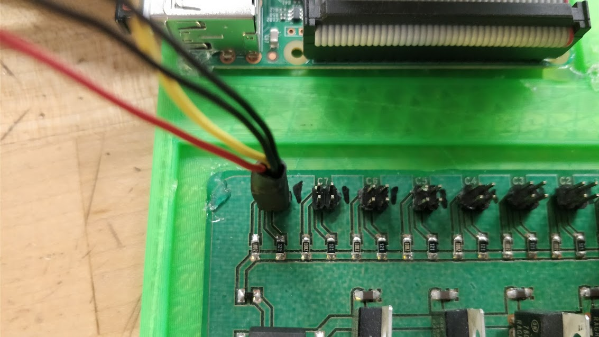
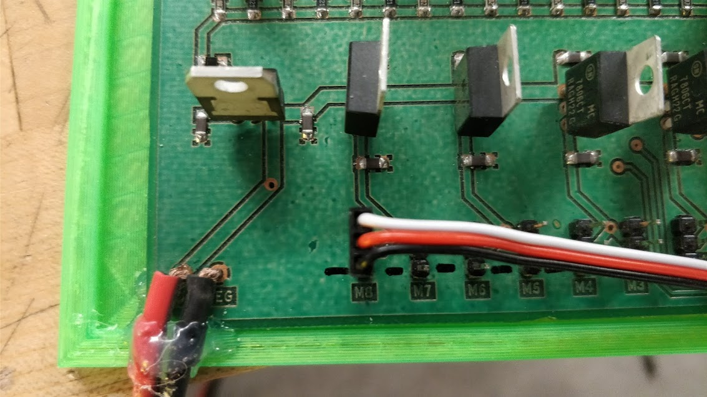

Automated Food Delivery Cages for rats
=============================
This project was to outfit a rat cage with a system that record the revolutions of an excersize wheel and dispense food automatically.

To start the code was written on a Raspberry Pi so it is recommended to implement this there.

Required components
-----------------------------
| Software | Hardware | Optional |
| -------- | -------- | -------- |
| Python 3.6 | Servos and the mounting hardware | Custom PCB (Breakout board for servo powering and sensor connecting) |
| Bash | IR Sensors |     | 
| Local version of this repository | Layfeyette Instruments Rat Cage with excersize wheel |    |

Quick Start: Hardware
-----------------------------
This is designed for the custom PCB. If you aren't using that find the signal connections in GPIOClient.

1. Make sure all connections are secure the first time and that your sensor and motors are paired correctly.
2. Make sure the wires have ground on the correct side of the connection.

| Sensor | Motor |
| ------ | ----- |
|  | 

Quick Start: Software
-----------------------------
Have everything connected to the GPIO Pins outlined in the GPIOClient.
Start running the files in order.

1. Double Click and "execute in terminal" the startup.sh

That should open a Terminal and you should be good to go from there as long as everything is connected correctly.

Quick Start: Troubleshooting
-----------------------------
If you are not getting the correct readings from the sensor.
1. Make sure the connector is seated properly
2. Make sure the wires in the connector are seated properly
That should fix most issues with sensor reading. If it does not it is possibly a slightly more significant hardware issue.
